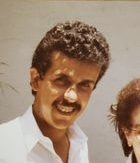
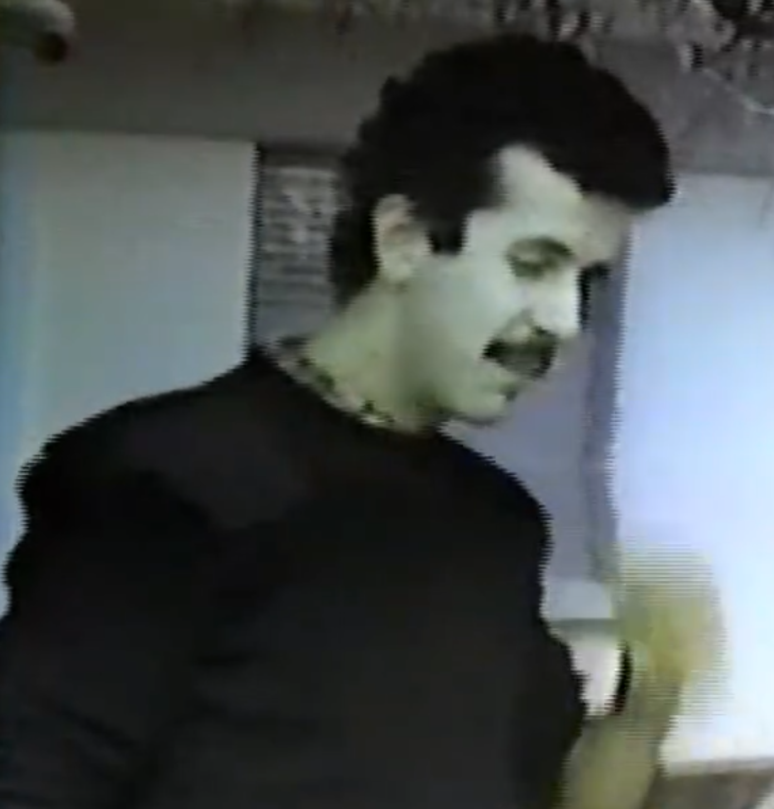
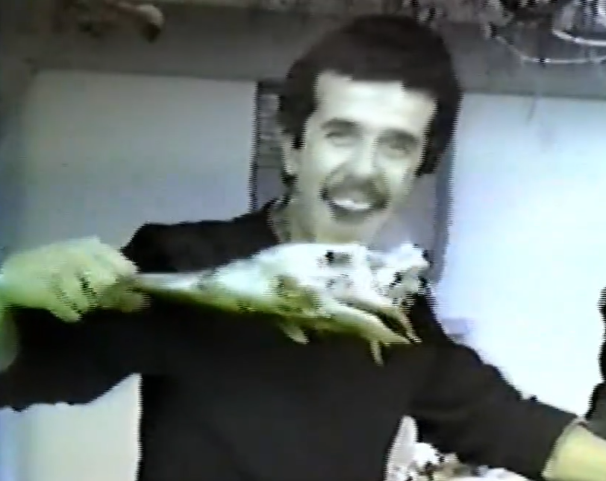
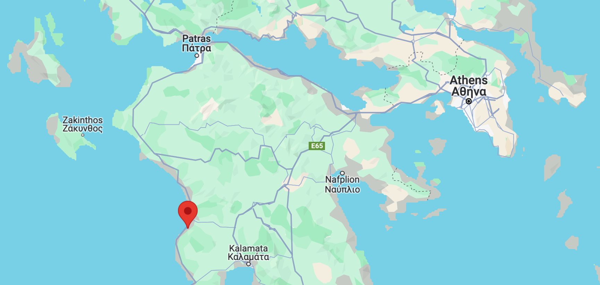
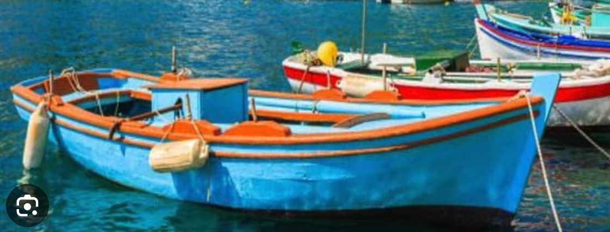

# Looking for Johnny Sfiris from Hellenikon AB Greece in 1986

I worked with Johnny Sfiris on Hellenikon Air Base, Greece, from Jan 1984 until Oct 1986. Johnny was the Land Mobile Radio (LMR) maintenance contractor, and as such, he fixed all the emergency services (e.g., fire, police) type of radios for all of the military units on Hellenikon, all of the remote locations (Araxos, Parnis, Pateris, etc), and several other US-centric agencies on mainland Greece (Voice of America, Embassy, US Army, US Navy, US Marines, etc).

Johnny was there before I got there and after I left, so I don't know the full date range that he was associated with Hellenikon. Although, John Kima on FB said that he worked with Johnny in the HF radio shop in 1980 or 1981, so Johnny was at least around from 1980-1986.

Here are some screen grabs I took from a video on the 2140th Communications Group Facebook Group. The post said it was a lamb roast at the radio shop in about 1983.

I know that he was a Greek-American and had a wife and son that lived somewhere in the area, perhaps Athens. If I recall correctly, he was separated or divorced.

In the 1985 timeframe, he was building a house on some land he owned near a fishing village on the Peloponnese. I think that was or was near his home village.

 Bobby Long worked with Johnny (and me) also and thinks his village may have been Kyparissia.

I went with Johnny to his village once. He was a local celebrity (everyone on the streets in his town knew him and gave him a big hug) and had a good time joking around with the folks in his village. The village folks called him Yiannis. His land was some distance away, maybe a couple of miles if I recall correctly, out by itself. I think he had about five acres, but I'm not sure. I'm sure he had several olive trees. He also had one of those quintessential Greek fishing boats that he kept nearby. He took me fishing out in the sea, using a huge net that he rolled in with a machine, and I have to say that some pretty odd looking creatures came up in that net.

 If I recall correctly, his boat looked something like this, but had a net winch on it.

Johnny worked for Planned Systems International (PSI), out of Kaneohe, Hawaii, via a government contract from Hellenikon Air Base.

One time we needed to go to Aroxos to fix a transceiver at the weapon storage area. Aroxos had a split base so we had to go to one area and go through some bureaucracy, then go a couple/few miles away and go through some more. Then, the radio had a couple different issues, so all in all, it took us a lot longer to get it fixed than we had planned. Come to find out, the American fuel place closed before we got done and we didn't have any fuel stamps to buy fuel on the ecconomy. Johnny told me to just sit in the passenger seat and nod politely, but not to speak. He drove up to the conscription-service troups at the Greek fuel area and talked to them. When they disagreed, he yelled a bunch of stuff in Greek, and even though they knew he was wrong, they filled us up.

Well down the road toward home, I asked what happened. He said, well, if they get in trouble, they get extra time added to their service, so I told them that I was working something important for the Greek Army and didn't have time to go get the paperwork for the fuel and that if they didn't give it to me I was going to call the general and get two months added to their service. He said they were scared to do it and scared not to do it, but decided since he was there, they would bet on doing it.

Then, he said, I don't feel bad getting the gas, since it's for the mission, and, I do free favors for the Greek government all the time. I asked what, and he said he fixed radios for several agencies in Athens for no charge when they have some important thing going on and don't have the time to turn a broken radio in to their own maintenance section. In any case, it was impressive and worked and we were able to get back to Hellenikon without having to pay out of our pockets or get stranded part-way back.

I tried doing some internet and Facebook searching, but can't seem to find any info on Johnny. So, if anyone sees this and knows how to contact him, please contact me at cwkingjr |@| gmail.
